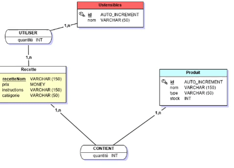

<a href="" ></a>

***Projet programmation Système A3***

# MasterChef Info 👨‍🍳🍽️

> Projet de 3ème année en EXIA, réalisé en 7 jours.


**Badges**


[](https://travis-ci.org/badges/badgerbadgerbadger) 

[](https://github.com/Theogorath/Projet-programmation-systeme)


***Visuel du programme :sparkles:*** 

<a href="" ></a>


## Table des matières 🏷️

- [Installation](#installation)
- [Architecture](#architecture)
- [Ameliorations](#ameliorations)
- [Team](#team)
- [FAQ](#faq)


---

## Example (Optional)

```C#
// Rien à voir pour le moment !
```

---

## Installation

- Vous pouvez télécharger directement le github etl'ouvrir avec votre IDE (dans le cas du projet nous avons choisi Visual Code)
- Vous pouvez aussi générer le programme si vous préférez un .exe

### Clone

- Cloner le repo vers la machine local en utilisant le lien suivant : `https://github.com/Theogorath/Projet-programmation-systeme.git`

### Setup
- Il faut tout d'abord installer la base de donnée, vous devez crée une table "masterchefinfo" sur un serveur Mysql, puis lancer le script d'exécution : [Cliquez ici](https://github.com/Theogorath/Projet-programmation-systeme/Livrables/BDD/masterchefinfo.sql)</br>


---

## Architecture

### BDD

Voici l'architecture MDC/MLD : </br>
 

### Desgin Patterns
Choix techniques :
- Observer : Pour que la vue puisse observer le modéle
- MVC : Pour structurer le programme
- Singleton : Pour eviter plusieurs instanciations d'une classe
- Facade : Pour simplifier l'utilisation des méthodes

### Diagrammes
 - La majorités des diagrammes sont en png, cependant les diagramme de composant à des fichiers .plantuml qui permettent de la réadapter    simplement pour les futures améliorations
 - Le diagramme de classe peut aussi être modifié via StarUML
---

## Ameliorations
> Nous sommes ouvert à toutes modifications ou proposition concernant le projet :thumbsup:
- Rajouter plus d'actions possibles 
- Plus de recettes
- Meilleur visualisation de la préparation des commandes
- Connecter à distance avec des IPC la DinnerRoom et la Kitchen


## Documentation 
- Lien vers les docs [ici](https://github.com/Theogorath/Projet-programmation-systeme/tree/master/Livrables) :link: 


## Team

> Notre équipe 💼

| <a href="https://github.com/Theogorath" target="_blank">**Theogorath**</a> | <a href="https://github.com/Logan06250" target="_blank">**Logan06250**</a> | <a href="https://github.com/HugoLA1" target="_blank">**HugoLA1**</a> |
| :---: |:---:| :---:|
| [](https://github.com/Theogorath)    | [](https://github.com/Logan06250) | [](https://github.com/HugoLA1)  |
| <a href="https://github.com/Theogorath" target="_blank">`Voir le GitHub de Theogorath`</a> | <a href="http://github.com/Logan06250" target="_blank">`Voir le GitHub de Logan06250`</a> | <a href="http://github.com/HugoLA1" target="_blank">`Voir le GitHub de HugoLA1`</a> |

- **Chef de Projet** : Logan06250
- **Développeurs** : HugoLA1& Theogorath
---

## FAQ
> Des soucis pour l'installation :question:
- **Je n'arrive pas à installer la BDD, comment faire ?**
- Veuillez vérifier que la table a bien le bon nom et que vous exécutez le script SQL dans cette derniére.

- **J'ai un souci avec les références concernant la SpriteLibrary, comment faire?**
- Si cela arrive vous devez faire un clique droit sur les références du projet "MasterChefInfo" puis "Ajouter une référence" et ensuite   dans projet il suffit de cocher SpriteLibrary.
---

## License

[](http://badges.mit-license.org)

- **[MIT license](http://opensource.org/licenses/mit-license.php)**
- Copyright 2018 ©
